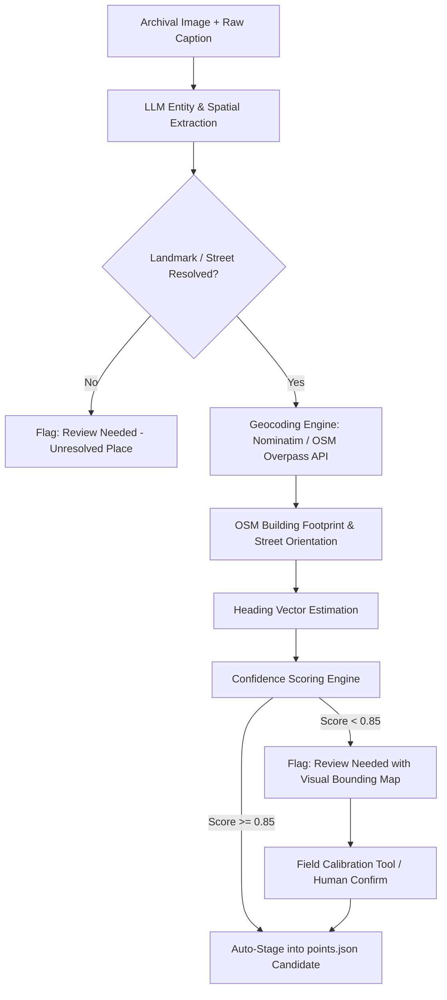

# Agent-Assisted Historical Photo Tagging Pipeline

## Overview

The slowest manual step in building historical AR experiences is discovering the exact `lat`, `lon`, and camera `heading` for archival photographs. Most archival photo listings provide only informal captions or descriptive text (e.g., *"Mushtifund Saunstha building, Mala, Fontainhas, looking west from 31st January Road, ca. 1930"*).

This document sketches an automated, LLM-powered tagging pipeline that converts unstructured archival captions into structured `points.json` entries while flagging low-confidence guesses for human review.



---

## 1. Pipeline Stages

### Stage 1: LLM Extraction & Spatial Reasoning
Given an archival metadata snippet:
- **Input**: Caption, year estimation, collection metadata.
- **LLM Task**: Extract:
  1. Primary Subject / Landmark Name.
  2. Sub-neighborhood / locality / city (e.g., Fontainhas, Panjim, Goa).
  3. Street or intersection references.
  4. Camera perspective cues (e.g., *"view facing north"*, *"façade facing the street"*, *"looking down Rua 31 de Janeiro"*).
  5. Estimated year / era.

#### Example Structured Output from LLM:
```json
{
  "place_name": "Mushtifund Saunstha",
  "locality": "Fontainhas, Mala, Panjim, Goa",
  "historical_aliases": ["Mushtifund School", "Bookworm Trust building"],
  "street_facing": "Rua 31 de Janeiro",
  "perspective_clue": "Front facade facing west across road",
  "year": 1930,
  "confidence_reasoning": "Explicit street name and building identity provided in archival note"
}
```

---

### Stage 2: Geocoding via OpenStreetMap / Overpass API
1. **Query OpenStreetMap Nominatim**: Resolve `place_name` + `locality` to a bounding polygon or building footprint node `(lat, lon)`.
2. **Fallback to Overpass API Query**: If exact building isn't indexed by name, query buildings within the street bounding polygon (`highway=residential, name='Rua 31 de Janeiro'`).

---

### Stage 3: Heading Vector & Viewing Angle Estimation
1. **Façade Vector Calculation**:
   - Query the OSM building footprint geometry.
   - Determine which side of the polygon faces the adjacent street centerline.
   - Compute the perpendicular vector from the street towards the building centroid.
2. **Camera Stand Point vs Building Coordinate**:
   - In historical AR, the user stands *in front* of the building looking towards it.
   - Standpoint coordinates = `Building Lat/Lon - (offset_meters * direction_vector)`.
   - Heading = Angle (0–360° clockwise from True North) from standpoint towards building façade.

---

### Stage 4: Confidence Scoring & Human-in-the-Loop Review

The pipeline computes a Composite Confidence Score (0.0 to 1.0):

| Dimension | Factor | Weight |
|---|---|---|
| **Geocoding Precision** | Building-level match vs Street-level vs Neighborhood | 40% |
| **Perspective Certainty** | Explicit caption clue vs building façade inference vs uncertain | 30% |
| **Year / Era Grounding** | Exact timestamp vs decade estimate vs unknown | 15% |
| **Visual Geometry Match** | Road alignment matches perspective | 15% |

- **Confidence $\ge$ 0.85 (High)**: Staged for production candidate pool.
- **Confidence < 0.85 (Medium/Low)**: Flagged with reasoning (`"Ambiguous building number"`, `"Heading estimated from road orientation only"`).
- **Human Verification**: Displayed in an interactive review UI (or calibrated in-situ using the Timeglass **Field Calibration HUD**).

---

## 2. Integration with Timeglass

When a human reviewer stands on site in Panjim or verifies a point:
1. Open Timeglass on mobile at the site.
2. Tap the `⚙` HUD icon.
3. Tap **"📋 Copy GPS & Heading (JSON)"**.
4. Paste the verified coordinates directly into `points.json`.
